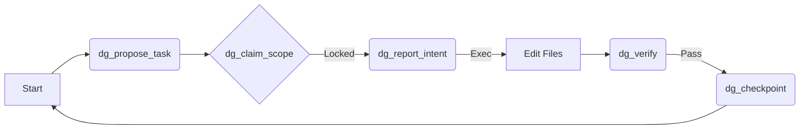

<div align="center">

# 🛡️ DriftGuard
### A Firewall for Intelligence

[](https://www.npmjs.com/package/@soufienne/mcp-server-driftguard)
[](LICENSE)
[](https://modelcontextprotocol.io)

**Strict State Machine • Zero-Loss Continuity • L3 Integrity**

[Getting Started](#-getting-started) •
[The Manifesto](#-the-manifesto) •
[Documentation](#-documentation)

</div>

---

## 🧐 What is DriftGuard?

**DriftGuard** is an implementing server for the **Model Context Protocol (MCP)** that acts as a "Traffic Controller" for AI Agents.

Most agents suffer from **"Code Drift"**: they edit random files, lose context, and hallucinate checkpoints. DriftGuard solves this by enforcing a **Strict Recursive State Machine**. An agent *cannot* touch code until it has:
1.  **Proposed** a task.
2.  **Claimed** a scope (locking files).
3.  **Declared** intent.

It is not just a tool; it is an **Agreement Architecture**.

---

## 🚀 Getting Started

You can run DriftGuard instantly using `npx`. No configuration required.

### One-Command Install
```bash
npx @modelcontextprotocol/inspector npx @soufienne/mcp-server-driftguard
```

### Manual Installation (For Development)
```bash
# 1. Clone the repository
git clone https://github.com/ramailo1/mcp-server-driftguard.git
cd mcp-server-driftguard

# 2. Install dependencies & Build
npm install
npm run build

# 3. Launch the Inspector
npm run inspect
```

---

## 📜 The Manifesto (Workflow)

DriftGuard enforces a linear, verifiable cycle.



### 1. 📝 Propose & Plan
Define your objective. DriftGuard creates a structured `ACTIVE_PLAN.md` and tracks progress.
- `dg_propose_task`: Start a new mission.

### 2. 🔒 Scope Claiming
Prevent agents from stepping on each other's toes.
- `dg_claim_scope`: Lock file paths (e.g., `src/**/*.ts`).
- **Integrity**: Automatically snapshots file hashes (MD5) to detect "Time-Travel" hacks.

### 3. ⚡ Intent & Action
Never act without declaring *why*.
- `dg_report_intent`: "I am identifying the bug in user.ts"
- `dg_verify`: Run your test command. *Proves* the code works.

### 4. 💾 Checkpoint & Continuity
Save your game.
- `dg_checkpoint`: Commits L3 Git Notes.
- `dg_generate_handoff`: **Resume Packet**. Serializes the entire session state for the next agent.

---

## 🛠️ The Toolkit

| Tool | Purpose | Phase |
| :--- | :--- | :--- |
| `dg_init` | Initialize DriftGuard in a repo | Core |
| `dg_status` | Get current tasks & state | Core |
| `dg_claim_scope` | **Lock** files for exclusive editing | Traffic |
| `dg_report_intent` | Declare next move (Required before checkpt) | Action |
| `dg_verify` | Run verification command | Action |
| `dg_health_check` | Detect manual file tampering | Integrity |
| `dg_generate_handoff` | Create resume packet for next session | Continuity |
| `dg_reset` | **Hard Reset** (Safety Valve) | Safety |

---

## 🤝 Contributing

We welcome contributions "at the speed of thought."
1.  Fork the repo (`ramailo1/mcp-server-driftguard`).
2.  Create your feature branch.
3.  Commit your changes.
4.  Push to the branch.
5.  Open a Pull Request.

## 📄 License

This project is licensed under the MIT License - see the [LICENSE](LICENSE) file for details.

---

<div align="center">

**Built with ❤️ for the Age of Agents.**
*@soufienne*

</div>
